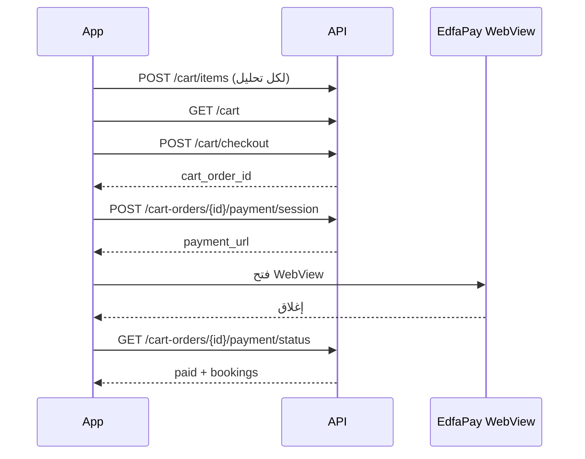

# API السلة (Cart) — حجز عدة تحاليل ودفع واحد

> للتطبيق (Flutter). **الحجز المفرد** عبر `POST /api/bookings` + دفعه كما هو **لم يتغيّر**.

---

## الفكرة

1. المستخدم يضيف تحاليل إلى **السلة** (نفس المختبر فقط).
2. **Checkout** ينشئ `cart_order` + عدة `bookings` معلقة.
3. **دفعة واحدة** بمجموع السلة عبر EdfaPay.
4. عند نجاح الدفع تُؤكَّد **كل** الحجوزات تلقائياً.

معرّف الدفع في البوابة: `CO{id}` (مثال: `CO15`) — لا تستخدم `booking.id` لدفع السلة.

---

## قواعد السلة

| القاعدة | التفاصيل |
|---------|----------|
| مختبر واحد | لا تخلط مختبرات في نفس السلة (422 عند الإضافة) |
| عنصر مكرر | نفس `provider_service_id` + `time_slot_id` → تحديث وليس تكرار |
| رسوم المنزل | تُحسب **مرة واحدة** على أول عنصر عند `home_service` |
| بعد Checkout | تُفرغ السلة؛ الحجوزات تبقى مربوطة بـ `cart_order_id` |

---

## 1) عرض السلة

```http
GET /api/cart
Authorization: Bearer {token}
```

**استجابة:**
```json
{
  "success": true,
  "data": {
    "provider_id": 3,
    "provider": {
      "id": 3,
      "business_name_ar": "مختبر X",
      "business_name_en": "Lab X"
    },
    "items": [
      {
        "id": 1,
        "provider_service_id": 10,
        "time_slot_id": 55,
        "branch_id": 2,
        "service_type": "in_clinic",
        "service": { "id": 5, "name_ar": "تحليل دم", "name_en": "CBC" },
        "time_slot": {
          "date": "2026-05-25",
          "start_time": "08:00:00",
          "period_key": "morning",
          "period_label_ar": "الفترة الثانية (6 ص - 12 م)"
        },
        "line_total": 120.5,
        "pricing": { "total_amount": 120.5, "service_price": 130, "discount_amount": 9.5, "vat_amount": 0 }
      }
    ],
    "summary": {
      "subtotal_amount": 130,
      "discount_amount": 9.5,
      "vat_amount": 0,
      "home_service_fee": 0,
      "total_amount": 120.5,
      "currency": "SAR",
      "items_count": 1
    }
  }
}
```

---

## 2) إضافة إلى السلة

```http
POST /api/cart/items
Authorization: Bearer {token}
Content-Type: application/json
```

**Body** (نفس حقول الحجز المفرد تقريباً):
```json
{
  "provider_service_id": 10,
  "time_slot_id": 55,
  "service_type": "in_clinic",
  "branch_id": 2,
  "latitude": 24.71,
  "longitude": 46.67,
  "nationality": "saudi",
  "notes": ""
}
```

للمنزل أضف: `home_address`, `home_city`, `home_district`, `home_latitude`, `home_longitude`.

**استجابة:** نفس شكل `GET /api/cart` في `data`.

---

## 3) حذف عنصر / إفراغ السلة

```http
DELETE /api/cart/items/{item_id}
DELETE /api/cart
```

---

## 4) Checkout (إنشاء الطلب والحجوزات)

```http
POST /api/cart/checkout
Authorization: Bearer {token}
```

**Body اختياري:**
```json
{ "nationality": "saudi" }
```

**استجابة 201:**
```json
{
  "success": true,
  "message": "تم إنشاء الطلب. أكمل الدفع لمجموع التحاليل.",
  "data": {
    "id": 15,
    "order_number": "CRT-XXXXXXXXXX",
    "payment_order_id": "CO15",
    "items_count": 3,
    "payment_status": "pending",
    "summary": {
      "total_amount": 350.75,
      "currency": "SAR"
    },
    "bookings": [ ... ]
  }
}
```

احفظ `data.id` كـ `cart_order_id` للدفع.

---

## 5) الدفع (مجموع السلة)

### إنشاء جلسة WebView

```http
POST /api/cart-orders/{cart_order_id}/payment/session
Authorization: Bearer {token}
```

**Body اختياري:**
```json
{ "return_url": "myapp://payment-return" }
```

إن لم يُرسل `return_url` يستخدم السيرفر رابط `guest-return` موقّعاً لطلب السلة.

**استجابة:**
```json
{
  "success": true,
  "payment_url": "https://...",
  "order_id": "CO15",
  "cart_order_id": 15,
  "total_amount": 350.75,
  "items_count": 3,
  "currency": "SAR"
}
```

افتح `payment_url` في WebView.

### بعد إغلاق WebView

```http
GET /api/cart-orders/{cart_order_id}/payment/status
Authorization: Bearer {token}
```

**استجابة عند النجاح:**
```json
{
  "success": true,
  "data": {
    "payment_status": "paid",
    "total_amount": 350.75,
    "bookings": [
      { "id": 101, "booking_number": "RS-...", "payment_status": "paid", "status": "confirmed" }
    ]
  }
}
```

---

## 6) تفاصيل طلب السلة

```http
GET /api/cart-orders/{id}
```

---

## 7) الحجز المفرد (بدون سلة) — بدون تغيير

```
POST /api/bookings
POST /api/bookings/{id}/payment/session
GET /api/bookings/{id}/payment/status
```

إذا حاول التطبيق دفع حجز مرتبط بسلة غير مدفوعة:

```json
{
  "success": false,
  "message": "هذا الحجز جزء من طلب سلة. ادفع المجموع عبر طلب السلة.",
  "cart_order_id": 15,
  "payment_endpoint": "/api/cart-orders/15/payment/session"
}
```

---

## تدفق مقترح في التطبيق



---

## نماذج Dart (مختصرة)

```dart
class CartSummary {
  final double totalAmount;
  final int itemsCount;
  // fromJson: data.summary
}

class CartCheckoutResult {
  final int cartOrderId;
  final String paymentOrderId; // CO{id}
  final double totalAmount;
}
```

---

## واجهة الموقع (ويب)

بعد تسجيل الدخول كمستخدم:

| الصفحة | المسار |
|--------|--------|
| السلة | `/user/cart` |
| إضافة تحليل | من صفحة المختبر: **أضف إلى السلة** أو من نموذج الحجز |
| الدفع | `/user/cart-orders/{id}/payment` |

شريط التنقل يعرض **السلة** مع عداد العناصر.

---

## على السيرفر (مرة واحدة)

```bash
php artisan migrate --force
```

جدولان: `cart_orders`, `cart_items` + عمود `bookings.cart_order_id`.

---

*مرجع إضافي: `API_AUTH.md` — قسم السلة.*
